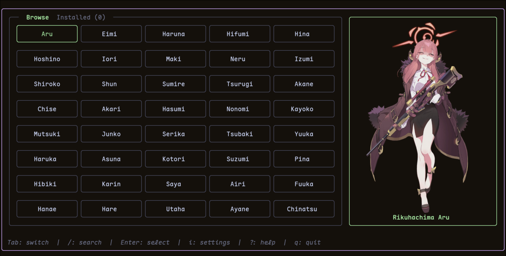

# schale-pick

A terminal UI for swapping the [fastfetch](https://github.com/fastfetch-cli/fastfetch) logo
with a Blue Archive student portrait. Browse the full SchaleDB roster, preview portraits
inline using the Kitty Graphics Protocol, and rewrite your fastfetch `config.jsonc` with one
keystroke.



## Features

- **Live preview** via Kitty Graphics Protocol (also degrades to `raw` for non-Kitty terminals).
- **Two-pane layout**: searchable grid on the left, portrait preview on the right.
- **Online + offline**: portraits are downloaded once from SchaleDB and cached locally.
- **LRU cache** with a configurable size limit (no unbounded disk growth).
- **Auto-backup**: your existing `config.jsonc` is copied to `.bak` on first write.
- **Surgical config patches**: only `.logo.source`, `.logo.type`, `.logo.width`, and
  `.logo.padding.left` are modified — the rest of your fastfetch config is left intact.
- **Settings screen**: change cache size, toggle auto-backup, switch logo format on the fly.

## Requirements

| Tool         | Why                                                          |
|--------------|--------------------------------------------------------------|
| Go ≥ 1.25    | Build the binary.                                            |
| `fastfetch`  | The whole point — must already have a `config.jsonc` with a `logo` block. |
| `jq`         | Used to surgically patch `~/.config/fastfetch/config.jsonc`. |
| `magick`     | (ImageMagick) Used to read portrait dimensions for sizing.   |
| Kitty / WezTerm / Konsole / Ghostty | Recommended for inline preview rendering. Other terminals fall back gracefully. |

> **Note:** `~/.config/fastfetch/config.jsonc` must already exist and contain a `"logo": {}` block.
> Run `fastfetch --gen-config` once if you haven't already.

Install the **runtime dependencies** (not the app — see [Install](#install) below):

**Arch / Arch-based** (Manjaro, EndeavourOS, CachyOS, …)
```bash
sudo pacman -S fastfetch jq imagemagick
```

**Debian / Ubuntu-based** (Mint, Pop!_OS, …)
```bash
sudo apt install fastfetch jq imagemagick
```

## Install

### Arch Linux

#### Option 1 — AUR (once published)

[`schale-pick-bin`](https://aur.archlinux.org/packages/schale-pick-bin) tracks
the pre-built binary from the latest GitHub release and pulls in `fastfetch`,
`jq`, and `imagemagick` automatically.

```bash
yay  -S schale-pick-bin
# or: paru -S schale-pick-bin
```

> Maintainer notes: see [`packaging/aur/README.md`](packaging/aur/README.md).

#### Option 2 — install the pre-built `.pkg.tar.zst`

Each tagged release ships an x86_64 Arch package built in CI. Download the
latest one from the [Releases page](https://github.com/dungdinhmanh/schale-pick/releases/latest)
and install it with pacman:

```bash
curl -LO https://github.com/dungdinhmanh/schale-pick/releases/latest/download/schale-pick-bin-x86_64.pkg.tar.zst
sudo pacman -U schale-pick-bin-x86_64.pkg.tar.zst
```

Verify the checksum first if you like:

```bash
curl -LO https://github.com/dungdinhmanh/schale-pick/releases/latest/download/schale-pick-bin-x86_64.pkg.tar.zst.sha256
sha256sum -c schale-pick-bin-x86_64.pkg.tar.zst.sha256
```

#### Option 3 — build from the bundled PKGBUILD (works on any arch)

```bash
git clone --depth=1 https://github.com/dungdinhmanh/schale-pick
cd schale-pick/packaging/aur/schale-pick-bin
makepkg -si
```

`makepkg` will fetch the matching binary (`amd64` or `arm64`) from the GitHub
release and install it.

### Pre-built binary (other Linux)

Download the latest release from the [Releases page](https://github.com/dungdinhmanh/schale-pick/releases/latest):

```bash
# Linux x86_64
curl -L https://github.com/dungdinhmanh/schale-pick/releases/latest/download/schale-pick-linux-amd64 \
  -o schale-pick
chmod +x schale-pick
sudo mv schale-pick /usr/local/bin/
```

```bash
# Linux ARM64
curl -L https://github.com/dungdinhmanh/schale-pick/releases/latest/download/schale-pick-linux-arm64 \
  -o schale-pick
chmod +x schale-pick
sudo mv schale-pick /usr/local/bin/
```

Verify the checksum:

```bash
sha256sum -c schale-pick-linux-amd64.sha256
```

### From source

```bash
git clone https://github.com/dungdinhmanh/schale-pick
cd schale-pick
go build -o schale-pick .
sudo install -m 0755 schale-pick /usr/local/bin/
```

## Usage

```bash
schale-pick
```

| Key           | Action                                            |
|---------------|---------------------------------------------------|
| `←`/`→`/`h`/`l` | Move cursor left/right                          |
| `↑`/`↓`/`k`/`j` | Move cursor up/down                             |
| `Tab`           | Switch between **Browse** and **Installed** tabs |
| `/`             | Search by name                                  |
| `Enter`         | Select student → patch fastfetch config         |
| `i`             | Open settings                                   |
| `?`             | Help                                            |
| `q` / `Ctrl+C`  | Quit                                            |

### CLI flags

```
schale-pick [flags]

  --version       print version and exit
  --clear-cache   delete all cached portraits and exit
  --debug         write debug log to /tmp/schale-pick-debug.log
  --help          show this help
```

## How it patches your config

When you press `Enter`, the app runs:

```bash
jq --arg source <portrait-path> \
   --arg itype  <kitty|raw> \
   --argjson width <calculated> \
   '.logo.source   = $source
  | .logo.type     = $itype
  | .logo.width    = $width
  | .logo.padding.left = 2' \
   ~/.config/fastfetch/config.jsonc
```

Only those four fields change. Your modules, separators, colors, and any other custom
fields are preserved. A `.bak` is written on first run if auto-backup is enabled
(default: on).

## Cache layout

```
~/.cache/schale-pick/
├── students.json          # SchaleDB roster (fetched on startup, used offline as fallback)
├── meta.json              # student ID → name mapping for offline use
└── portrait/
    └── <student-id>.webp  # cached portraits (one per student)
```

Default cache size is 5 portraits; configurable from the settings screen (1–20).

## Settings

| Setting       | Values        | Default | Notes |
|---------------|---------------|---------|-------|
| Logo Format   | `kitty`/`raw` | auto    | `kitty` uses graphics protocol; `raw` falls back to ANSI block art. |
| Cache Size    | 1–20          | 5       | LRU eviction once limit is hit. |
| Auto Backup   | on / off      | on      | When on, backs up silently on first write. When off, asks for confirmation first. |

## Contributing

Issues and PRs welcome — see [CONTRIBUTING.md](CONTRIBUTING.md) for the full guide.

This project uses [Conventional Commits](https://www.conventionalcommits.org/) and [Semantic Versioning](https://semver.org/).
The codebase is small (~3k LOC) and uses [Bubble Tea v2](https://github.com/charmbracelet/bubbletea) + [Lipgloss v2](https://github.com/charmbracelet/lipgloss).

## License

MIT — see [LICENSE](LICENSE).

Portrait artwork is © Yostar / Nexon and served via [SchaleDB](https://schaledb.com/home).
This project only links to those images; it does not redistribute them.
